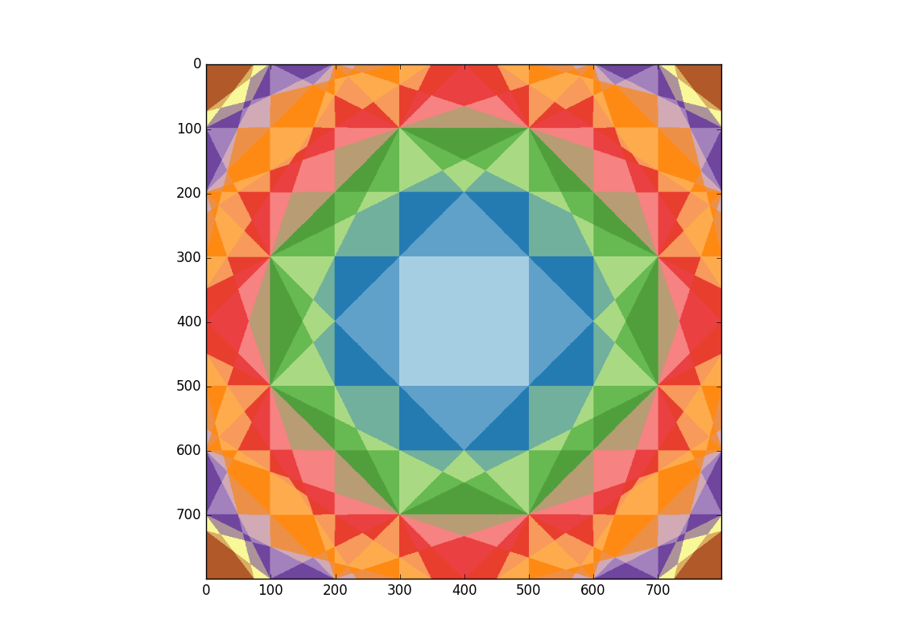
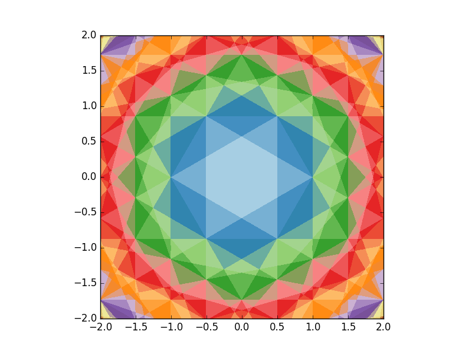

A simple python/numpy script for calculating successive Brillouin
zones of lattices.  The nth Brillouin zone of a given (reciprocal)
lattice is the region where the origin is the nth nearest point; see
https://en.wikipedia.org/wiki/Brillouin_zone.

It works by taking a collection of lattice points and working out the
rank of the origin when these points are ordered according to their
distance from an arbitrary given point.  This is done for each point
in the image.

Here are the first few zones for a square lattice:

The pale blue zone is the first Brillouin zone, moving outwards from
the origin are the subsequent zones.

For a simple hexagonal lattice:

